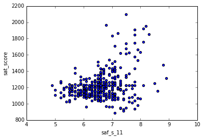
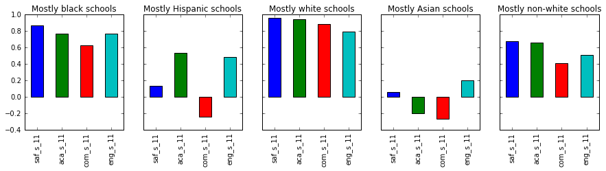
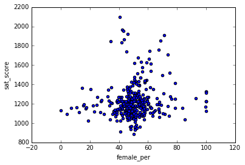

# Read in the data


```python
import pandas as pd
import numpy as np
import re

data_files = [
    "ap_2010.csv",
    "class_size.csv",
    "demographics.csv",
    "graduation.csv",
    "hs_directory.csv",
    "sat_results.csv"
]

data = {}

for f in data_files:
    d = pd.read_csv("schools/{0}".format(f))
    data[f.replace(".csv", "")] = d
```

# Read in the surveys


```python
all_survey = pd.read_csv("schools/survey_all.txt", delimiter="\t", encoding='windows-1252')
d75_survey = pd.read_csv("schools/survey_d75.txt", delimiter="\t", encoding='windows-1252')
survey = pd.concat([all_survey, d75_survey], axis=0)

survey["DBN"] = survey["dbn"]

survey_fields = [
    "DBN", 
    "saf_p_11", 
    "com_p_11", 
    "eng_p_11", 
    "aca_p_11", 
    "saf_t_11", 
    "com_t_11", 
    "eng_t_11", 
    "aca_t_11", 
    "saf_s_11", 
    "com_s_11", 
    "eng_s_11", 
    "aca_s_11", 
    "saf_tot_11", 
    "com_tot_11", 
    "eng_tot_11", 
    "aca_tot_11",
]
survey = survey.loc[:,survey_fields]
data["survey"] = survey
```

# Add DBN columns


```python
data["hs_directory"]["DBN"] = data["hs_directory"]["dbn"]

def pad_csd(num):
    string_representation = str(num)
    if len(string_representation) > 1:
        return string_representation
    else:
        return "0" + string_representation
    
data["class_size"]["padded_csd"] = data["class_size"]["CSD"].apply(pad_csd)
data["class_size"]["DBN"] = data["class_size"]["padded_csd"] + data["class_size"]["SCHOOL CODE"]
```

# Convert columns to numeric


```python
cols = ['SAT Math Avg. Score', 'SAT Critical Reading Avg. Score', 'SAT Writing Avg. Score']
for c in cols:
    data["sat_results"][c] = pd.to_numeric(data["sat_results"][c], errors="coerce")

data['sat_results']['sat_score'] = data['sat_results'][cols[0]] + data['sat_results'][cols[1]] + data['sat_results'][cols[2]]

def find_lat(loc):
    coords = re.findall("\(.+, .+\)", loc)
    lat = coords[0].split(",")[0].replace("(", "")
    return lat

def find_lon(loc):
    coords = re.findall("\(.+, .+\)", loc)
    lon = coords[0].split(",")[1].replace(")", "").strip()
    return lon

data["hs_directory"]["lat"] = data["hs_directory"]["Location 1"].apply(find_lat)
data["hs_directory"]["lon"] = data["hs_directory"]["Location 1"].apply(find_lon)

data["hs_directory"]["lat"] = pd.to_numeric(data["hs_directory"]["lat"], errors="coerce")
data["hs_directory"]["lon"] = pd.to_numeric(data["hs_directory"]["lon"], errors="coerce")
```

# Condense datasets


```python
class_size = data["class_size"]
class_size = class_size[class_size["GRADE "] == "09-12"]
class_size = class_size[class_size["PROGRAM TYPE"] == "GEN ED"]

class_size = class_size.groupby("DBN").agg(numpy.mean)
class_size.reset_index(inplace=True)
data["class_size"] = class_size

data["demographics"] = data["demographics"][data["demographics"]["schoolyear"] == 20112012]

data["graduation"] = data["graduation"][data["graduation"]["Cohort"] == "2006"]
data["graduation"] = data["graduation"][data["graduation"]["Demographic"] == "Total Cohort"]
```

# Convert AP scores to numeric


```python
cols = ['AP Test Takers ', 'Total Exams Taken', 'Number of Exams with scores 3 4 or 5']

for col in cols:
    data["ap_2010"][col] = pd.to_numeric(data["ap_2010"][col], errors="coerce")
```

# Combine the datasets


```python
combined = data["sat_results"]

combined = combined.merge(data["ap_2010"], on="DBN", how="left")
combined = combined.merge(data["graduation"], on="DBN", how="left")

to_merge = ["class_size", "demographics", "survey", "hs_directory"]

for m in to_merge:
    combined = combined.merge(data[m], on="DBN", how="inner")

combined = combined.fillna(combined.mean())
combined = combined.fillna(0)
```

# Add a school district column for mapping


```python
def get_first_two_chars(dbn):
    return dbn[0:2]

combined["school_dist"] = combined["DBN"].apply(get_first_two_chars)
```

# Find correlations


```python
correlations = combined.corr()
correlations = correlations["sat_score"]
print(correlations)
```

    SAT Critical Reading Avg. Score         0.986820
    SAT Math Avg. Score                     0.972643
    SAT Writing Avg. Score                  0.987771
    sat_score                               1.000000
    AP Test Takers                          0.523140
    Total Exams Taken                       0.514333
    Number of Exams with scores 3 4 or 5    0.463245
    Total Cohort                            0.325144
    CSD                                     0.042948
    NUMBER OF STUDENTS / SEATS FILLED       0.394626
    NUMBER OF SECTIONS                      0.362673
    AVERAGE CLASS SIZE                      0.381014
    SIZE OF SMALLEST CLASS                  0.249949
    SIZE OF LARGEST CLASS                   0.314434
    SCHOOLWIDE PUPIL-TEACHER RATIO               NaN
    schoolyear                                   NaN
    fl_percent                                   NaN
    frl_percent                            -0.722225
    total_enrollment                        0.367857
    ell_num                                -0.153778
    ell_percent                            -0.398750
    sped_num                                0.034933
    sped_percent                           -0.448170
    asian_num                               0.475445
    asian_per                               0.570730
    black_num                               0.027979
    black_per                              -0.284139
    hispanic_num                            0.025744
    hispanic_per                           -0.396985
    white_num                               0.449559
                                              ...   
    male_num                                0.325520
    male_per                               -0.112062
    female_num                              0.388631
    female_per                              0.112108
    saf_p_11                                0.122913
    com_p_11                               -0.115073
    eng_p_11                                0.020254
    aca_p_11                                0.035155
    saf_t_11                                0.313810
    com_t_11                                0.082419
    eng_t_11                                0.036906
    aca_t_11                                0.132348
    saf_s_11                                0.337639
    com_s_11                                0.187370
    eng_s_11                                0.213822
    aca_s_11                                0.339435
    saf_tot_11                              0.318753
    com_tot_11                              0.077310
    eng_tot_11                              0.100102
    aca_tot_11                              0.190966
    grade_span_max                               NaN
    expgrade_span_max                            NaN
    zip                                    -0.063977
    total_students                          0.407827
    number_programs                         0.117012
    priority08                                   NaN
    priority09                                   NaN
    priority10                                   NaN
    lat                                    -0.121029
    lon                                    -0.132222
    Name: sat_score, Length: 61, dtype: float64


# Plotting survey correlations


```python
# Remove DBN since it's a unique identifier, not a useful numerical value for correlation.
survey_fields.remove("DBN")
```


```python
combined.corr()["sat_score"][survey_fields].plot.bar()
```


    <matplotlib.axes._subplots.AxesSubplot at 0x7f15958ad6a0>


```python
student_cols = [col for col in combined.columns if '_s_11' in col]
teacher_cols = [col for col in combined.columns if '_t_11' in col]
parent_cols = [col for col in combined.columns if '_p_11' in col]

combined['student_mean'] = combined[student_cols].mean(axis=1)
combined['teacher_mean'] = combined[teacher_cols].mean(axis=1)
combined['parent_mean'] = combined[parent_cols].mean(axis=1)

combined.corr()["sat_score"][['student_mean','teacher_mean','parent_mean']].plot.bar(title='Survey Target Comparison')

```


    <matplotlib.axes._subplots.AxesSubplot at 0x7f15958d3080>


Positive responses from students are much more highly correlated than parent and teacher responses.


```python
combined.plot.scatter(x='saf_s_11', y='sat_score')
```


    <matplotlib.axes._subplots.AxesSubplot at 0x7f15958f3b38>





```python
# compute the average safety score for each district
safety_by_district = combined.groupby('school_dist')[['saf_s_11','lat','lon','sat_score']].agg(np.mean).reset_index()
latitudes = safety_by_district['lat'].tolist()
longitudes = safety_by_district['lon'].tolist()

from mpl_toolkits.basemap import Basemap
m = Basemap(
    projection='merc',
    llcrnrlat=40.496044,
    urcrnrlat=40.915256,
    llcrnrlon=-74.255735,
    urcrnrlon=-73.700272,
    resolution='i')
m.drawmapboundary(fill_color='#85a6d9')
m.drawcoastlines(color='#6d5f47', linewidth=.4)
m.drawrivers(color='#6d5f47', linewidth=.4)
m.scatter(longitudes, latitudes, s=20, zorder=2, latlon=True, c=safety_by_district['saf_s_11'], cmap='summer')
```


    <matplotlib.collections.PathCollection at 0x7f15a06030b8>


# Investigate racial differences in SAT scores


```python
race_cols = ['white_per','asian_per','black_per','hispanic_per']
combined.corr()['sat_score'][race_cols].plot.bar()
```


    <matplotlib.axes._subplots.AxesSubplot at 0x7f15a0398470>


Blacks and Hispanics have the lowest SAT scores... but why?


```python
fig, axes = plt.subplots(nrows=1, ncols=5, figsize=(15,3), sharey=True)
xlabels = ['saf_s_11','aca_s_11','com_s_11','eng_s_11']

def plot_correlations(index, df, title):
    race_correlations = df.corr()["sat_score"][xlabels]
    race_correlations.plot.bar(ax=axes[index], title=title)

plot_correlations(0, combined[combined.black_per > 50], 'Mostly black schools')
plot_correlations(1, combined[combined.hispanic_per > 50], 'Mostly Hispanic schools')
plot_correlations(2, combined[combined.white_per > 50], 'Mostly white schools')
plot_correlations(3, combined[combined.asian_per > 50], 'Mostly Asian schools')
plot_correlations(4, combined[combined.white_per < 50], 'Mostly non-white schools')

```


In mostly white schools, the survey results are a strong predictor of SAT scores, but were a non-factor in other schools.


```python
# What are the demographics of school districts with high test scores?

def convert_percentage(old_key, new_key):
    combined[new_key] = pd.to_numeric(combined[old_key].str.replace('%',''), errors='coerce')

convert_percentage("Total Grads - % of cohort", "Total Grads - % of cohort (numeric)")
convert_percentage("Dropped Out - % of cohort", "Dropped Out - % of cohort (numeric)")

school_districts = combined[['DBN','SCHOOL NAME', 'Num of SAT Test Takers', 'sat_score', 'AP Test Takers ', 'Total Exams Taken', 'Number of Exams with scores 3 4 or 5', 'Total Grads - % of cohort (numeric)', 'Dropped Out - % of cohort (numeric)', 'AVERAGE CLASS SIZE', 'frl_percent', 'total_enrollment', 'ell_percent', 'asian_per', 'white_per', 'black_per', 'hispanic_per', 'school_dist']] \
    .groupby('school_dist').agg(np.mean).reset_index().sort_values('sat_score', ascending=False)

def plot_factors(columns):    
    school_districts[columns + ['school_dist']].plot.line(x='school_dist', figsize=(10,5))
    
plot_factors(['sat_score', 'AP Test Takers ', 'Number of Exams with scores 3 4 or 5'])
plot_factors(["Total Grads - % of cohort (numeric)", "Dropped Out - % of cohort (numeric)"])
plot_factors(['sat_score', 'total_enrollment'])
plot_factors(['AVERAGE CLASS SIZE', 'frl_percent', 'ell_percent'])
```


School districts with more AP classes, higher graduation rates, and higher total enrollment generally do better on SAT tests.  Foreign language students do significantly worse.  Total enrollment doesn't make sense as a direct predictor of success.


```python
school_districts.plot.scatter(x='total_enrollment', y='frl_percent')
print('correlation between enrollment and foreign language: ' + str(school_districts.corr()['total_enrollment']['frl_percent']))
```

    correlation between enrollment and foreign language: -0.6572548899730897


Schools that focus on serving international students will likely be smaller.  Therefore, total enrollment is not a good predictor of success, the foreign language factor is what's important.  Let's see what happens when we graph correlation of survey results for primarily English speaking schools.


```python
fig, axes = plt.subplots(nrows=1, ncols=5, figsize=(15,3), sharey=True)
xlabels = ['saf_s_11','aca_s_11','com_s_11','eng_s_11']

def plot_correlations(index, df, title):
    print(title + ' - ' + str(df.shape[0]) + ' rows')
    race_correlations = df.corr()["sat_score"][xlabels]
    race_correlations.plot.bar(ax=axes[index], title=title)

english_speaking = combined[combined.frl_percent < 50]    
plot_correlations(0, english_speaking[english_speaking.black_per > 50], 'Mostly black schools')
plot_correlations(1, english_speaking[english_speaking.hispanic_per > 50], 'Mostly Hispanic schools')
plot_correlations(2, english_speaking[english_speaking.white_per > 50], 'Mostly white schools')
plot_correlations(3, english_speaking[english_speaking.asian_per > 50], 'Mostly Asian schools')
plot_correlations(4, english_speaking[english_speaking.white_per < 50], 'Mostly non-white schools')
```

    Mostly black schools - 7 rows
    Mostly Hispanic schools - 3 rows
    Mostly white schools - 11 rows
    Mostly Asian schools - 4 rows
    Mostly non-white schools - 41 rows





When we exclude schools with a high percentage of foreign students, the survey results are a much better predictor or test scores in both primarily white and primarily non-white schools.  The correlation is much more positive for black schools with the foreign language schools excluded.


```python
combined.plot.scatter(x='female_per',y='sat_score')
```


    <matplotlib.axes._subplots.AxesSubplot at 0x7f15a3ed04a8>





Females in mixed gender schools seem to do the best, but the general correlation is weak.


```python
combined['ap_per'] = combined['AP Test Takers '] / combined['total_enrollment']
```


```python
combined.plot.scatter(x='ap_per',y='sat_score')
```


    <matplotlib.axes._subplots.AxesSubplot at 0x7f1594cc07f0>


```python
combined.corr()['sat_score']['ap_per']
```


    0.05717081390766967


```python
# is there a correlation between good SAT scores and AP classes?
combined[combined['sat_score'] > 1600].corr()['sat_score']['ap_per']
```


    0.7263717628372337


There is a very strong correlation between AP classes and good SAT scores.

# Overall Conclusions

These appear to be the biggest factors in schools with good test scores:
* Schools with large populations of foreign language speaking students had significantly lower scores.
* Students that feel that they have acacdemic expectations, safety, and respect have higher test scores
* In schools with good test scores, 


```python

```


```python

```
